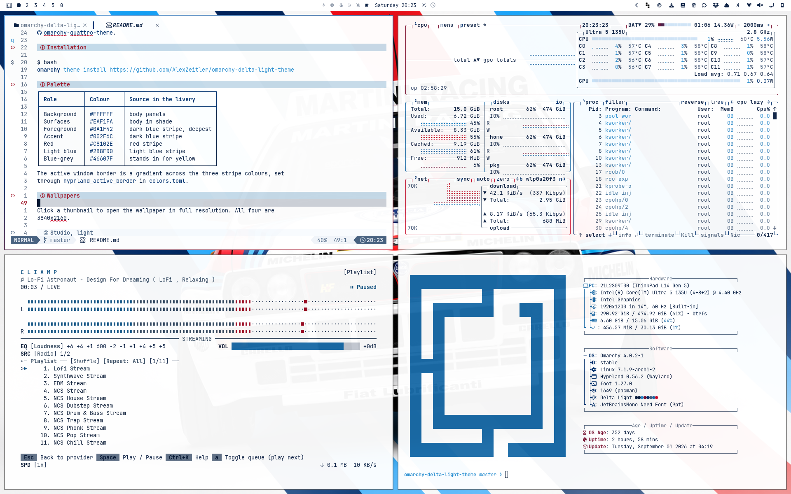
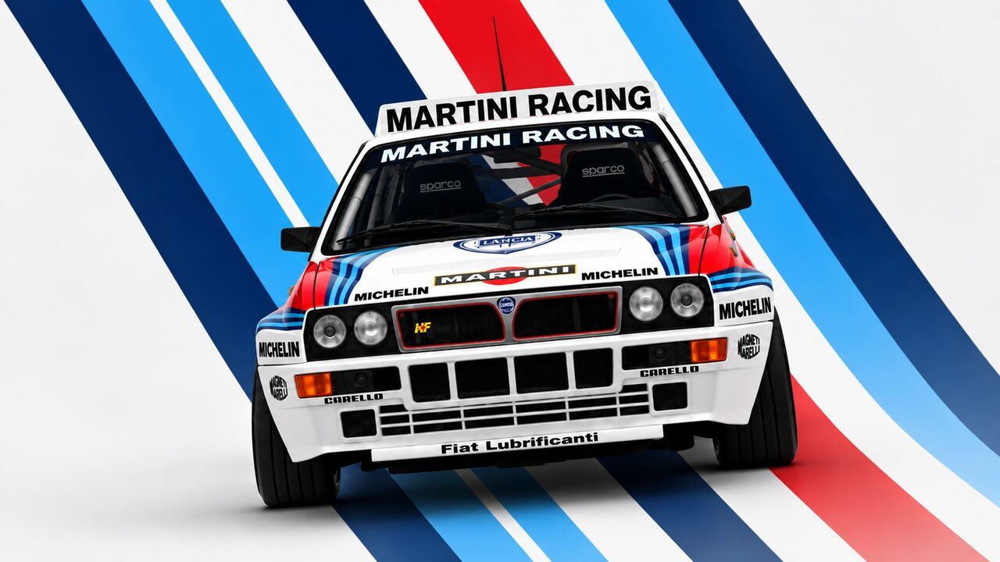
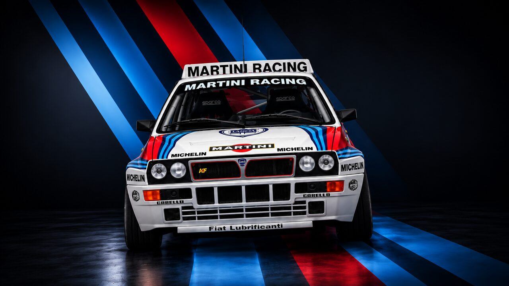
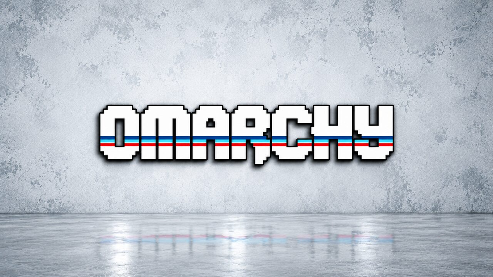
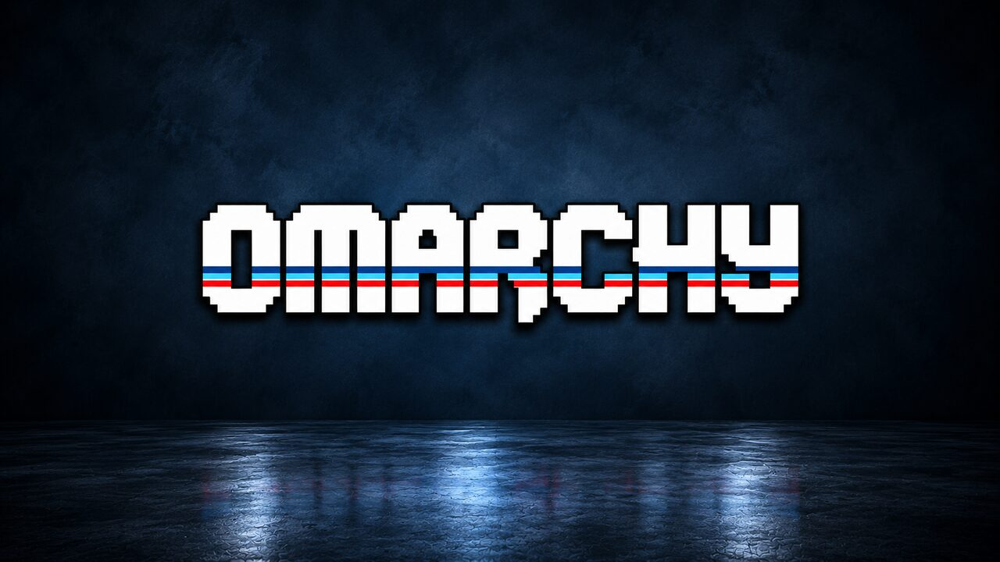

# omarchy-delta-light-theme



A light Omarchy theme built from the Group A rally livery of the Lancia Delta
Integrale: a white body with three stripes in red, light blue and dark blue.

The palette is deliberately narrow. Every slot the terminal needs holds either
a red, a blue or a blue-grey. Orange and magenta are darker steps of the red,
green sits between the two blues, and yellow has no counterpart in the livery
at all and is a blue-grey. Warnings are therefore not yellow, and `git diff`
marks additions in blue.

The dark counterpart is
[omarchy-delta-dark-theme](https://github.com/AlexZeitler/omarchy-delta-dark-theme).

## Why Delta

Omarchy 4 is called Quattro, a tribute to the Audi quattro, one of the most
popular rally cars ever built. It brought all-wheel drive to the sport and
owned the early eighties. The Lancia Delta Integrale picked up where it left
off and took six manufacturers' titles in a row: two cars, each the icon of
its era. And the four comes along for free, delta being the fourth letter of
the Greek alphabet.

The quattro has a theme of its own:
[omarchy-quattro-theme](https://github.com/AlexZeitler/omarchy-quattro-theme).

## Installation

```bash
omarchy theme install https://github.com/AlexZeitler/omarchy-delta-light-theme
```

## Palette

| Role        | Colour    | Source in the livery      |
|-------------|-----------|---------------------------|
| Background  | `#FFFFFF` | body panels               |
| Surfaces    | `#EAF1FA` | body in shade             |
| Foreground  | `#0A1F42` | dark blue stripe, deepest |
| Accent      | `#002F6C` | dark blue stripe          |
| Red         | `#C8102E` | red stripe                |
| Light blue  | `#2B8FD0` | light blue stripe         |
| Blue-grey   | `#46607F` | stands in for yellow      |

The active window border is a gradient across the three stripe colours, set
through `hyprland_active_border` in `colors.toml`.

## Wallpapers

Click a thumbnail to open the wallpaper in full resolution. All four are
3840x2160.

### Studio, light

[](backgrounds/01-studio-light-4k.png)

### Studio, dark

[](backgrounds/02-studio-dark-4k.png)

### Omarchy, light

[](backgrounds/03-light-4k.png)

### Omarchy, dark

[](backgrounds/04-dark-4k.png)

## VS Code

Nothing to install. Since Omarchy 4 the colour scheme is generated from
`colors.toml`, installed as the local extension `local.omarchy-theme` and
selected automatically. To check that it took:

```bash
grep colorTheme ~/.config/Code/User/settings.json
```

## GTK

Omarchy copies `gtk.css` into `~/.local/state/omarchy/current/theme` but never
deploys it. GTK reads `~/.config/gtk-3.0/gtk.css` and
`~/.config/gtk-4.0/gtk.css` and nothing else, so out of the box the GTK
colours never reach Nautilus or the GTK file dialogs. Those windows keep
whatever background they had under an earlier theme.

Link the hook once:

```bash
mkdir -p ~/.config/omarchy/hooks/theme-set.d
ln -s ~/.config/omarchy/themes/delta-light/hooks/gtk \
  ~/.config/omarchy/hooks/theme-set.d/gtk
```

From then on every theme switch writes the GTK colours of whichever theme you
picked, not just this one. The hook only touches the section between its own
markers, so anything you wrote into those files yourself survives. Switching
to a theme without a `gtk.css` removes the section again.

Only one hook can be linked under the name `gtk`. If a link is already there,
check where it points before replacing it:

```bash
readlink ~/.config/omarchy/hooks/theme-set.d/gtk
```

### Going back

No theme shipped with Omarchy carries a `gtk.css`. Switching to one of them
therefore removes the section on its own, and GTK falls back to whatever was
in the file before.

To drop the hook entirely, remove the symlink and run it once by hand:

```bash
rm ~/.config/omarchy/hooks/theme-set.d/gtk
~/.config/omarchy/themes/delta-light/hooks/gtk --remove
```

## License

MIT
